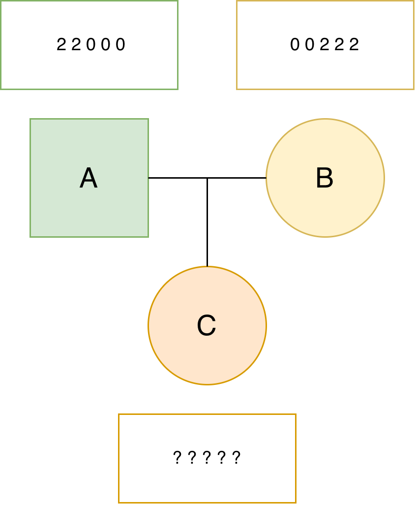

===============
Getting Started
===============

Install |Software|
------------------

Here is a sample guide for installing |Software| as a Python package.

For more information on installing Python packages,
visit `Python Packaging User Guide <https://packaging.python.org/en/latest/tutorials/installing-packages/>`_.

Install via pip
===============

|Software| is available on `PyPI <https://pypi.org/project/AlphaImpute2>`_
hence you can install it simply by running the following command in a terminal:

.. code-block:: bash

    pip install AlphaImpute2

Install from the git repository
===============================

You can also install |Software| from the code in git repository.

Clone the repository:

.. code-block:: bash

    git clone --recurse-submodules https://github.com/AlphaGenes/AlphaImpute2.git

Change the working directory to the one holding the repository:

.. code-block:: bash

    cd AlphaImpute2

Create a virtual environment:

.. code-block:: bash

    python -m venv AlphaImpute2_env

Activate the environment:

    - If you are using macOS/Linux:

        .. code-block:: bash

            source AlphaImpute2_env/bin/activate

    - If you are using Windows:

        .. code-block:: console

            AlphaImpute2-env\Scripts\activate

Upgrade pip:

.. code-block:: bash

    python -m pip install --upgrade pip

Upgrade the build:

.. code-block:: bash

    python -m pip install --upgrade build

Build the distributions:

.. note::

    If you are building on a branch other than the main branch,
    you may need to first check if the submodule reference is correct before the build.

.. code-block:: bash

    python -m build

Install the package by using the built wheel distribution:

.. code-block:: bash

    python -m pip install dist/alphaimpute2*.whl

Run examples
============
.. _run-examples:

Change the working directory to the one holding the example:

.. code-block:: bash

    cd example

Run the example:

.. code-block:: bash

    bash run_examples.sh

If you have installed R, you can check the accuracy of the example code:

.. code-block:: bash

    Rscript check_accuracy.R

Deactivate the environment:

.. code-block:: bash

    deactivate

Install on Eddie
================

.. note::

    This section is only for the users from the University of Edinburgh.

To use |Software| on the Eddie, the University of Edinburgh's Research Compute Cluster,
you can find information to create an environment without causing the home directory to go over quota at
`Eddie wiki page <https://www.wiki.ed.ac.uk/spaces/ResearchServices/pages/294388305/Anaconda>`_.

If you encountered the issue that the files show as modified directly after a git clone,
you may can try:

.. code-block:: bash

    git config core.fileMode false

An example
----------

The following is a very simple example to demonstrate
the principle of estimating unknown haplotypes and genotypes.
The example is deliberately simplistic for the demonstration.
Note that |Software| can handle much more complex examples.
The example contains two parents with known genotypes and
one progeny with unknown genotypes.

Our task is to estimate the haplotypes of all the individuals (we name this task "phasing") and
genotypes of the progeny (we name this task "imputation").
Since the two parents are fully homozygous and the progeny has no information,
you can easily solve this problem yourself and check your solution with |Software|.

We first prepare a genotype input file:

.. code-block::

    A 2 2 0 0 0
    B 0 0 2 2 2
    C 9 9 9 9 9

And a pedigree file:

.. code-block::

    A 0 0
    B 0 0
    C A B

We named the two file as ``simple_genotype.txt`` and ``simple_pedigree.txt``.
You can create the files yourself.
They are also available in the ``example/simple_example/`` directory of the repository.
To use these files you have to change the working directory to the one holding the simple example:

.. code-block:: bash

    cd simple_example

We perform the phasing and imputation with the following command:

.. code-block:: bash

    AlphaImpute2 \
                -genotypes simple_genotype.txt \
                -pedigree simple_pedigree.txt \
                -ped_only \
                -out simple_output
    
Above we provided the two input files, asked for the pedigree-only method, and
requested the output filenames starting with ``simple_output``.

If the run was successful,
you should see the following output:

.. code-block:: bash

    ------------------------------------------
                AlphaImpute2               
    ------------------------------------------
    Version: 0.0.3
    Email:   alphagenes@roslin.ed.ac.uk
    Website: http://alphagenes.roslin.ed.ac.uk
    ------------------------------------------
    Reading in AlphaGenes format: simple_genotype.txt
    Read in: 0.00 seconds

            Pedigree Imputation Only         
    ------------------------------------------
    Number of peeling cycles: 4
    Final cutoff: 0.1

    Imputation cycle 1
    Peel down: 3.57 seconds
    Peel up: 2.40 seconds

    Imputation cycle 2
    Peel down: 0.00 seconds
    Peel up: 0.00 seconds

    Imputation cycle 3
    Peel down: 0.00 seconds
    Peel up: 0.00 seconds

    Imputation cycle 4
    Peel down: 0.00 seconds
    Peel up: 0.00 seconds
    Core peeling cycles: 5.97 seconds
    Heuristic Peeling: 7.03 seconds

            Writing Out Results            
    ------------------------------------------
    Write out: 0.00 seconds
    Full Program Run: 7.18 seconds

And the following output file:

.. code-block:: bash

    simple_output.genotypes

The ``simple_output.genotypes`` provides the called genotypes:

.. code-block:: bash

    A 2 2 0 0 0
    B 0 0 2 2 2
    C 1 1 1 1 1

For more information about how to use |Software|, please see :ref:`usage`.